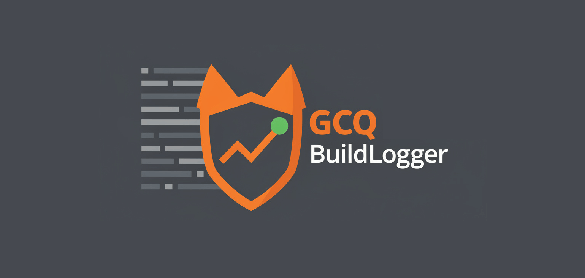

DotNet.GitlabCodeQualityBuildLogger
===
[](https://github.com/timo-reymann/DotNet.GitlabCodeQualityBuildLogger/releases)
[](https://www.nuget.org/packages/GitlabCodeQualityBuildLogger.Tool/)
[](https://github.com/timo-reymann/DotNet.GitlabCodeQualityBuildLogger/blob/main/LICENSE)
[](https://github.com/timo-reymann/DotNet.GitlabCodeQualityBuildLogger/actions/workflows/ci.yml)
[![Renovate](https://img.shields.io/badge/renovate-enabled-green?logo=data:image/svg+xml;base64,PHN2ZyB4bWxucz0iaHR0cDovL3d3dy53My5vcmcvMjAwMC9zdmciIHZpZXdCb3g9IjAgMCAzNjkgMzY5Ij48Y2lyY2xlIGN4PSIxODkuOSIgY3k9IjE5MC4yIiByPSIxODQuNSIgZmlsbD0iI2ZmZTQyZSIgdHJhbnNmb3JtPSJ0cmFuc2xhdGUoLTUgLTYpIi8+PHBhdGggZmlsbD0iIzhiYjViNSIgZD0iTTI1MSAyNTZsLTM4LTM4YTE3IDE3IDAgMDEwLTI0bDU2LTU2YzItMiAyLTYgMC03bC0yMC0yMWE1IDUgMCAwMC03IDBsLTEzIDEyLTktOCAxMy0xM2ExNyAxNyAwIDAxMjQgMGwyMSAyMWM3IDcgNyAxNyAwIDI0bC01NiA1N2E1IDUgMCAwMDAgN2wzOCAzOHoiLz48cGF0aCBmaWxsPSIjZDk1NjEyIiBkPSJNMzAwIDI4OGwtOCA4Yy00IDQtMTEgNC0xNiAwbC00Ni00NmMtNS01LTUtMTIgMC0xNmw4LThjNC00IDExLTQgMTUgMGw0NyA0N2M0IDQgNCAxMSAwIDE1eiIvPjxwYXRoIGZpbGw9IiMyNGJmYmUiIGQ9Ik04MSAxODVsMTgtMTggMTggMTgtMTggMTh6Ii8+PHBhdGggZmlsbD0iIzI1YzRjMyIgZD0iTTIyMCAxMDBsMjMgMjNjNCA0IDQgMTEgMCAxNkwxNDIgMjQwYy00IDQtMTEgNC0xNSAwbC0yNC0yNGMtNC00LTQtMTEgMC0xNWwxMDEtMTAxYzUtNSAxMi01IDE2IDB6Ii8+PHBhdGggZmlsbD0iIzFkZGVkZCIgZD0iTTk5IDE2N2wxOC0xOCAxOCAxOC0xOCAxOHoiLz48cGF0aCBmaWxsPSIjMDBhZmIzIiBkPSJNMjMwIDExMGwxMyAxM2M0IDQgNCAxMSAwIDE2TDE0MiAyNDBjLTQgNC0xMSA0LTE1IDBsLTEzLTEzYzQgNCAxMSA0IDE1IDBsMTAxLTEwMWM1LTUgNS0xMSAwLTE2eiIvPjxwYXRoIGZpbGw9IiMyNGJmYmUiIGQ9Ik0xMTYgMTQ5bDE4LTE4IDE4IDE4LTE4IDE4eiIvPjxwYXRoIGZpbGw9IiMxZGRlZGQiIGQ9Ik0xMzQgMTMxbDE4LTE4IDE4IDE4LTE4IDE4eiIvPjxwYXRoIGZpbGw9IiMxYmNmY2UiIGQ9Ik0xNTIgMTEzbDE4LTE4IDE4IDE4LTE4IDE4eiIvPjxwYXRoIGZpbGw9IiMyNGJmYmUiIGQ9Ik0xNzAgOTVsMTgtMTggMTggMTgtMTggMTh6Ii8+PHBhdGggZmlsbD0iIzFiY2ZjZSIgZD0iTTYzIDE2N2wxOC0xOCAxOCAxOC0xOCAxOHpNOTggMTMxbDE4LTE4IDE4IDE4LTE4IDE4eiIvPjxwYXRoIGZpbGw9IiMzNGVkZWIiIGQ9Ik0xMzQgOTVsMTgtMTggMTggMTgtMTggMTh6Ii8+PHBhdGggZmlsbD0iIzFiY2ZjZSIgZD0iTTE1MyA3OGwxOC0xOCAxOCAxOC0xOCAxOHoiLz48cGF0aCBmaWxsPSIjMzRlZGViIiBkPSJNODAgMTEzbDE4LTE3IDE4IDE3LTE4IDE4ek0xMzUgNjBsMTgtMTggMTggMTgtMTggMTh6Ii8+PHBhdGggZmlsbD0iIzk4ZWRlYiIgZD0iTTI3IDEzMWwxOC0xOCAxOCAxOC0xOCAxOHoiLz48cGF0aCBmaWxsPSIjYjUzZTAyIiBkPSJNMjg1IDI1OGw3IDdjNCA0IDQgMTEgMCAxNWwtOCA4Yy00IDQtMTEgNC0xNiAwbC02LTdjNCA1IDExIDUgMTUgMGw4LTdjNC01IDQtMTIgMC0xNnoiLz48cGF0aCBmaWxsPSIjOThlZGViIiBkPSJNODEgNzhsMTgtMTggMTggMTgtMTggMTh6Ii8+PHBhdGggZmlsbD0iIzAwYTNhMiIgZD0iTTIzNSAxMTVsOCA4YzQgNCA0IDExIDAgMTZMMTQyIDI0MGMtNCA0LTExIDQtMTUgMGwtOS05YzUgNSAxMiA1IDE2IDBsMTAxLTEwMWM0LTQgNC0xMSAwLTE1eiIvPjxwYXRoIGZpbGw9IiMzOWQ5ZDgiIGQ9Ik0yMjggMTA4bC04LThjLTQtNS0xMS01LTE2IDBMMTAzIDIwMWMtNCA0LTQgMTEgMCAxNWw4IDhjLTQtNC00LTExIDAtMTVsMTAxLTEwMWM1LTQgMTItNCAxNiAweiIvPjxwYXRoIGZpbGw9IiNhMzM5MDQiIGQ9Ik0yOTEgMjY0bDggOGM0IDQgNCAxMSAwIDE2bC04IDdjLTQgNS0xMSA1LTE1IDBsLTktOGM1IDUgMTIgNSAxNiAwbDgtOGM0LTQgNC0xMSAwLTE1eiIvPjxwYXRoIGZpbGw9IiNlYjZlMmQiIGQ9Ik0yNjAgMjMzbC00LTRjLTYtNi0xNy02LTIzIDAtNyA3LTcgMTcgMCAyNGw0IDRjLTQtNS00LTExIDAtMTZsOC04YzQtNCAxMS00IDE1IDB6Ii8+PHBhdGggZmlsbD0iIzEzYWNiZCIgZD0iTTEzNCAyNDhjLTQgMC04LTItMTEtNWwtMjMtMjNhMTYgMTYgMCAwMTAtMjNMMjAxIDk2YTE2IDE2IDAgMDEyMiAwbDI0IDI0YzYgNiA2IDE2IDAgMjJMMTQ2IDI0M2MtMyAzLTcgNS0xMiA1em03OC0xNDdsLTQgMi0xMDEgMTAxYTYgNiAwIDAwMCA5bDIzIDIzYTYgNiAwIDAwOSAwbDEwMS0xMDFhNiA2IDAgMDAwLTlsLTI0LTIzLTQtMnoiLz48cGF0aCBmaWxsPSIjYmY0NDA0IiBkPSJNMjg0IDMwNGMtNCAwLTgtMS0xMS00bC00Ny00N2MtNi02LTYtMTYgMC0yMmw4LThjNi02IDE2LTYgMjIgMGw0NyA0NmM2IDcgNiAxNyAwIDIzbC04IDhjLTMgMy03IDQtMTEgNHptLTM5LTc2Yy0xIDAtMyAwLTQgMmwtOCA3Yy0yIDMtMiA3IDAgOWw0NyA0N2E2IDYgMCAwMDkgMGw3LThjMy0yIDMtNiAwLTlsLTQ2LTQ2Yy0yLTItMy0yLTUtMnoiLz48L3N2Zz4=)](https://renovatebot.com)
[](https://sonarcloud.io/summary/new_code?id=timo-reymann_DotNet.GitlabCodeQualityBuildLogger)
[](https://sonarcloud.io/summary/new_code?id=timo-reymann_DotNet.GitlabCodeQualityBuildLogger)
[](https://sonarcloud.io/summary/new_code?id=timo-reymann_DotNet.GitlabCodeQualityBuildLogger)

<p align="center">
    
    <br />
    An MSBuild logger that outputs build warnings and errors in <a href="https://docs.gitlab.com/ee/ci/testing/code_quality.html#implement-a-custom-tool">GitLab Code Quality report format</a>.
</p>

## Features

- Captures build errors and warnings during `dotnet build`
- Outputs JSON in GitLab Code Quality format
- Automatic severity mapping:
  - Build errors → `critical`
  - CS* (compiler warnings) → `major`
  - CA2*/CA5* (security rules) → `major`
  - CA* (other code analysis) → `minor`
  - IDE*/SA* (style suggestions) → `info`
  - Other warnings → `minor`
- Generates stable fingerprints for issue tracking

## Requirements

- .NET SDK 6.0 or later (for running the tool)
- MSBuild-based project

## Installation

### Project-level (recommended)

```sh
dotnet new tool-manifest # if you don't have a tool manifest yet
dotnet tool install GitlabCodeQualityBuildLogger.Tool
```

### Global

```sh
dotnet tool install -g GitlabCodeQualityBuildLogger.Tool
```

## Usage

### Global

```sh
dotnet build -logger:"$(dotnet tool run gitlab-code-quality-logger);gl-code-quality-report.json"
```

### Global

```sh
dotnet build -logger:"$(gitlab-code-quality-logger);gl-code-quality-report.json"
```

### GitLab CI Example

```yaml
build:
  stage: build
  script:
    - dotnet tool restore
    - dotnet build -logger:"$(gitlab-code-quality-logger);gl-code-quality-report.json"
  artifacts:
    reports:
      codequality: gl-code-quality-report.json
```

### Output Format

The logger produces JSON compatible with GitLab's Code Quality report format:

```json
[
  {
    "description": "CS0168: The variable 'x' is declared but never used",
    "check_name": "CS0168",
    "fingerprint": "A1B2C3D4E5F6...",
    "severity": "major",
    "location": {
      "path": "src/MyClass.cs",
      "lines": {
        "begin": 42
      }
    }
  }
]
```

## Motivation

GitLab's Code Quality feature provides a great way to track code issues directly in merge requests. However, there was no simple way to integrate .NET build warnings and errors into this workflow. This logger bridges that gap by converting MSBuild output into GitLab's expected format.

## Contributing

I love your input! I want to make contributing to this project as easy and transparent as possible, whether it's:

- Reporting a bug
- Discussing the current state of the configuration
- Submitting a fix
- Proposing new features
- Becoming a maintainer

To get started please read the [Contribution Guidelines](./CONTRIBUTING.md).

## Development

### Requirements

- [.NET 9.0 SDK](https://dotnet.microsoft.com/download)

### Build

```sh
dotnet build
```

### Test

```sh
dotnet test
```

### Project Structure

```
src/
├── DotNet.GitlabCodeQualityBuildLogger/       # Core logger library (netstandard2.1)
└── DotNet.GitlabCodeQualityBuildLogger.Tool/  # CLI tool wrapper (net9.0)
tests/
└── DotNet.GitlabCodeQualityBuildLogger.Tests/ # xUnit tests
```

---
